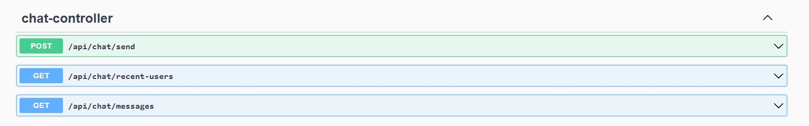
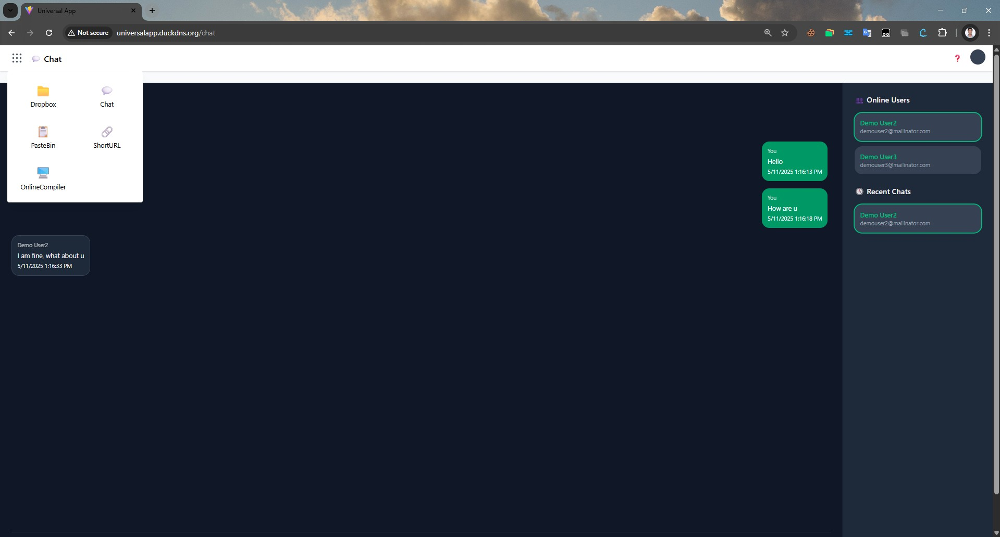
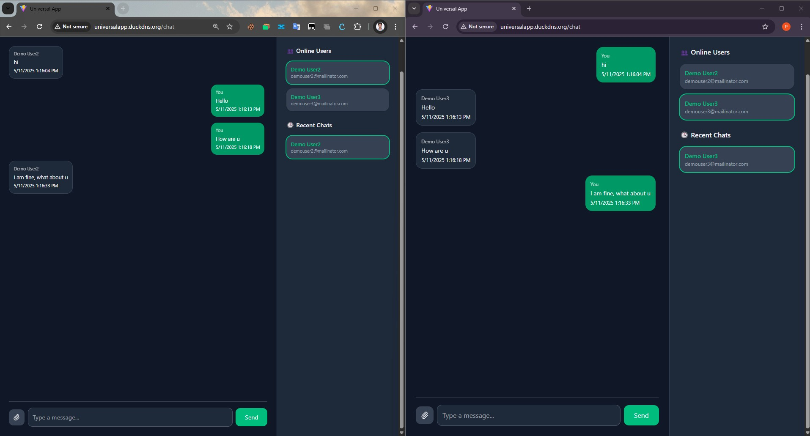

# 💬 ChatApp Service

ChatApp is a microservice in the UniversalApp platform that provides **1-to-1 real-time chat functionality** using **WebSocket**, **Redis**, and **Spring Boot**. It is integrated with the AcceptorService for authentication and exposed to the frontend via proxying.

---

## 📸 Screenshots

### Swagger UI

### App Selection

### ChatApp UI

---

---

## 🚀 Features

- 🔒 Secure WebSocket handshake using JWT  
- 👤 Tracks online users via Redis  
- 📩 Real-time messaging with delivery status  
- 📜 Message persistence with PostgreSQL  
- 🧩 Designed for modular integration with other services

---

## ⚙️ Technologies Used

| Component       | Tech Stack                        |
|----------------|------------------------------------|
| WebSocket       | Spring WebSocket                   |
| Auth            | JWT via AcceptorService            |
| State Tracking  | Redis                              |
| DB              | PostgreSQL                         |
| Deployment      | Docker, EC2                        |

---

## 📁 Project Structure

```bash
ChatAppService/
├── src/
│   ├── main/
│   │   ├── java/com/universal/chat/
│   │   │   ├── config/               # WebSocket config, Redis config
│   │   │   ├── controller/           # WebSocket handlers
│   │   │   ├── dto/                  # Request/Response objects
│   │   │   ├── service/              # Chat handling, persistence
│   │   │   └── ChatAppApplication.java
│   │   └── resources/
│   │       ├── application.yml
│   │       └── static/
├── Dockerfile
├── .env
└── README.md
````

---

## 🧪 Local Setup

### Prerequisites

* Java 17+
* Docker
* Redis
* PostgreSQL


## 🌐 API & WebSocket Endpoint

* REST API: GET - `http://<host>:8081/api/messages` - Retrieve Messages
* REST API: POST- `http://<host>:8081/api/send` - Send Message
* REST API: GET - `http://<host>:8081/api/recent-users` - List of recently connected users
* WebSocket: `ws://<host>:8081/ws/chat`

WebSocket connection requires a valid JWT in the `Authorization` header during handshake.

---

### Steps

```bash
git clone https://github.com/praveenkumarsh/ChatAppBackend.git
cd ChatAppBackend
./mvnw clean install
docker build -t chatapp-service .
docker run -d -p 8081:8081 --env-file .env chatapp-service
```
```
---

## 🧪 Testing

```bash
./mvnw test
```

---

## 🧩 Integration

This service is accessed via AcceptorService and is consumed by the UniversalApp frontend.

* [UniversalAppUI README](../UniversalAppUI/README.md)
* [AcceptorService README](../AcceptorService/README.md)

---

## 📜 License

Licensed under the [MIT License](../LICENSE).

```

Would you like me to generate the `README.md` for another service next?
```
