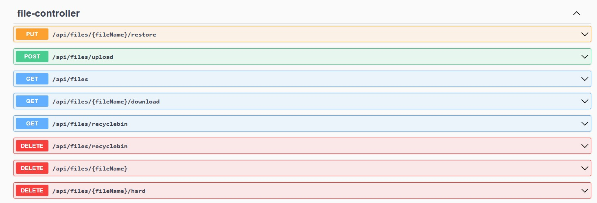
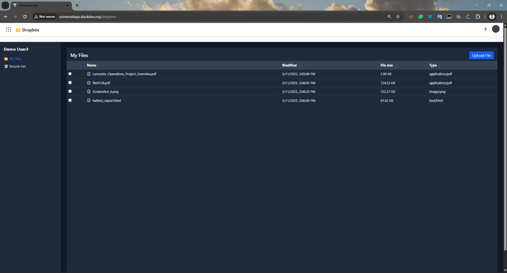
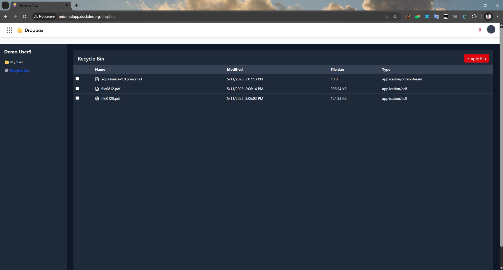
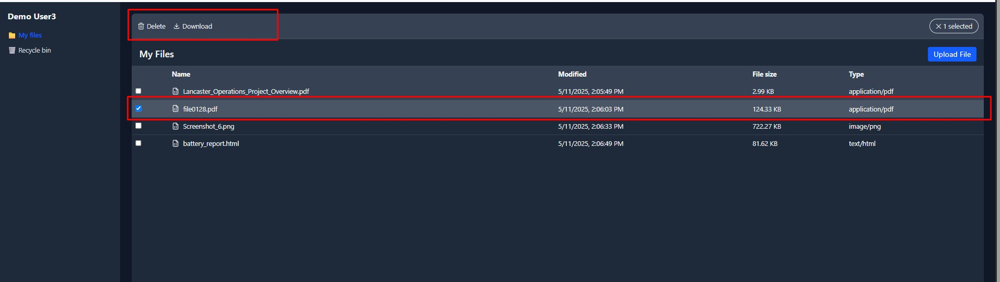
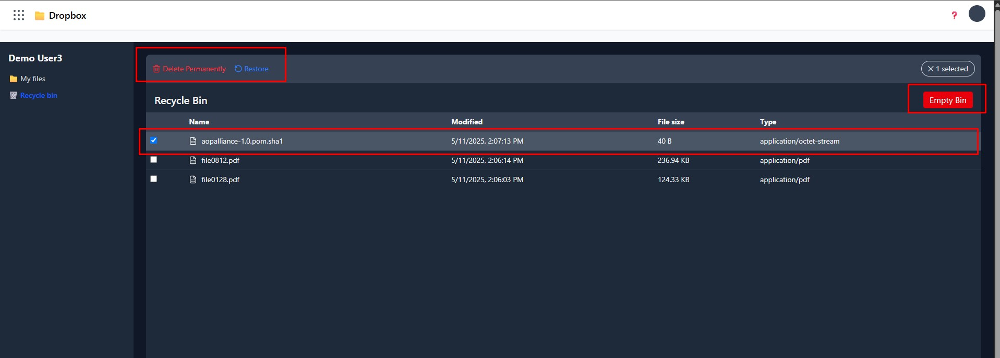

# 🗂️ FileManager Service

The FileManager service is a microservice within the **UniversalApp** ecosystem that allows users to upload, download, manage, and preview files via a secure and cloud-native backend using **Spring Boot**, **MinIO**, and **PostgreSQL**.

---

## 📸 Screenshots

### Swagger UI

### My Files

### RecycleBin

### My Files - Options

### RecycleBin - Options

---

---

## 🚀 Features

- 📁 File upload & download via REST API
- 🧾 Stores metadata in PostgreSQL
- ☁️ Object storage using MinIO (S3-compatible)
- 🔐 Secured access with JWT (validated via AcceptorService)
- 🧩 React frontend integration with folder structure & preview support

---

## ⚙️ Tech Stack

| Component         | Technology         |
|------------------|--------------------|
| Backend           | Spring Boot        |
| Auth              | JWT via AcceptorService |
| Storage           | MinIO (S3 compatible) |
| Metadata DB       | PostgreSQL         |
| Deployment        | Docker, AWS EC2    |


---

## 📁 Project Structure

```bash
FileManagerBackend/
├── src/
│   ├── main/
│   │   ├── java/com/universal/filemanager/
│   │   │   ├── controller/           # Upload, download, list APIs
│   │   │   ├── model/                # File entity, enums
│   │   │   ├── repository/           # Spring Data JPA
│   │   │   ├── service/              # MinIO interaction, metadata logic
│   │   │   └── FileManagerApplication.java
│   └── resources/
│       ├── application.yml
├── Dockerfile
├── .env
└── README.md
````

---

## 🧪 Local Setup

### Prerequisites

* Java 17+
* Docker
* MinIO
* PostgreSQL

### Steps

```bash
git clone https://github.com/praveenkumarsh/FileManagerBackend.git
cd FileManagerBackend
./mvnw clean install
docker build -t filemanager-service .
docker run -d -p 8084:8084 --env-file .env filemanager-service
```
```

---

## 🌐 API Endpoints

* `POST /api/files/upload` – Upload a file
* `GET /api/files/{id}` – Download file
* `GET /api/files` – List all files for the authenticated user
* `GET /api/files/recyclebin` – List all recyclebin files for the authenticated user
* `DELETE /api/files/recyclebin` – Delete all recyclebin files for the authenticated user
* `DELETE /api/files/{fileName}` – Move file to recyclebin for the authenticated user
* `DELETE /api/files/{fileName}/hard` – Permanent Delete file from recyclebin for the authenticated user
* `OUT /api/files/{fileName}/restore` – Restore deleted file file from recyclebin for the authenticated user

> All endpoints require JWT Authorization in the `Authorization` header.

---

## 🧪 Testing

```bash
./mvnw test
```

---

## 📦 Deployment

* Service runs on Docker and is deployed on an **EC2 instance**
* MinIO is accessible via a container or external S3-compatible host
* Environment variables are configured via `.env`

---

## 🧩 Integration

This service is integrated via the AcceptorService and accessed by UniversalAppUI.

* [UniversalAppUI README](../UniversalAppUI/README.md)
* [AcceptorService README](../AcceptorService/README.md)

---

## ✅ Future Enhancements

* ✅ File sharing with public/private links
* ✅ Preview for PDFs and images
* ✅ Folder organization and tagging

---

## 📜 License

Licensed under the [MIT License](../LICENSE).

---

