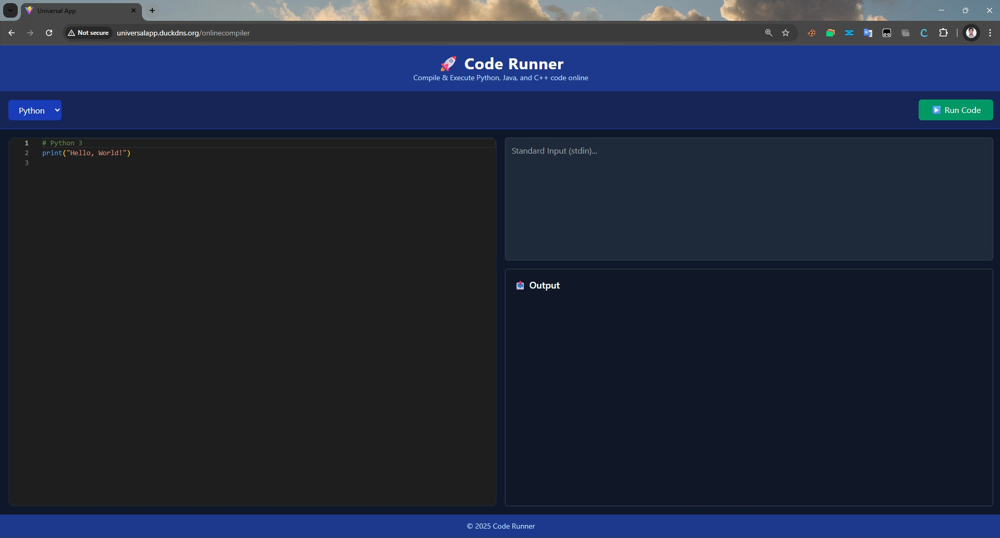
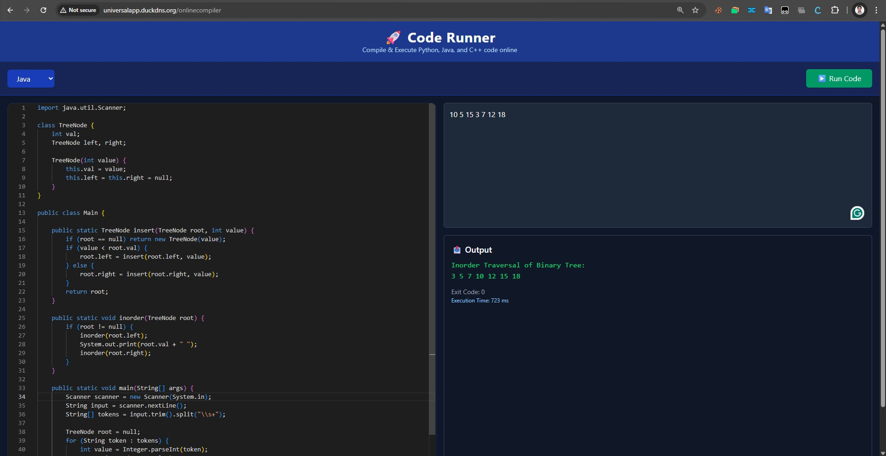
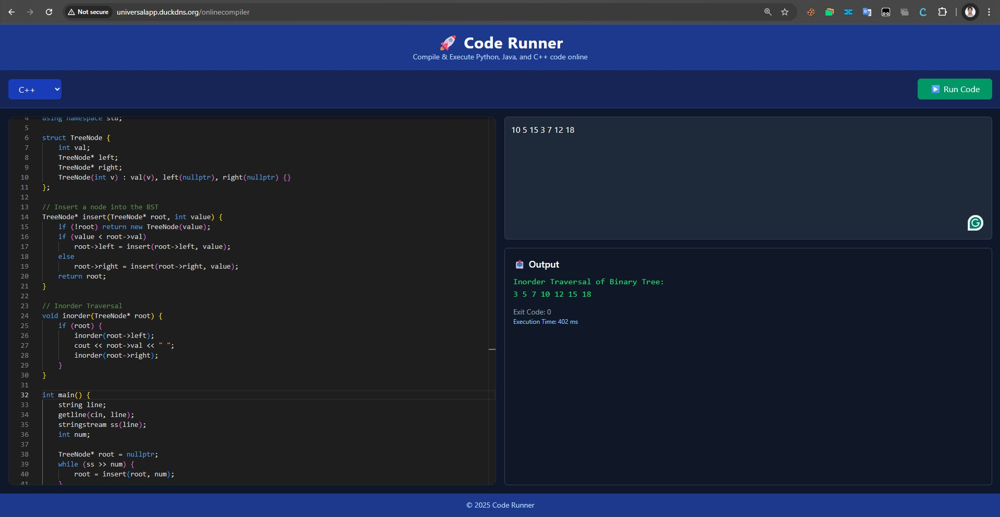

# 🧠 Online Compiler Service

The **Online Compiler** is a secure and extensible microservice within the **UniversalApp** suite, designed to compile and execute user-submitted code for supported languages like **Java**, **Python**, and **C++** using isolated Docker containers.

---

## 📸 Screenshots

### Swagger UI

### Main UI

### Java Online Compiler

### Cpp Online Compiler

### Python Online Compiler


---

## 🚀 Features

- 🧪 Secure code execution inside Docker containers
- 🛠️ Supports multiple languages: Java, Python, C++
- 🔐 Isolated execution environments (no shared state)
- ⚡ Fast response times via persistent containers or ephemeral ones (configurable)
- ✅ Authenticated access via AcceptorService (JWT)
- 📡 Exposed REST API for frontend and internal use

---

## ⚙️ Tech Stack

| Component         | Technology                   |
|------------------|------------------------------|
| Backend           | Java, Spring Boot            |
| Containerization  | Docker                       |
| Auth              | JWT via AcceptorService      |
| Languages         | Java, Python, C++            |
| Deployment        | Docker, AWS EC2              |

---

## 📁 Project Structure

```bash
OnlineCompilerBackend/
├── src/
│   ├── main/
│   │   ├── java/com/universal/compiler/
│   │   │   ├── controller/         # Code submission API
│   │   │   ├── model/              # Request/Response models
│   │   │   ├── service/            # Docker interaction logic
│   │   │   └── OnlineCompilerApp.java
│   └── resources/
│       └── application.yml
├── docker/
│   ├── java-runner/                # Dockerfile for Java execution
│   ├── python-runner/              # Dockerfile for Python execution
│   ├── cpp-runner/                 # Dockerfile for C++ execution
├── .env
├── Dockerfile
└── README.md
````

---

## 🌐 API Overview

### POST `/api/execute`

Submits source code for compilation and returns stdout/stderr.

**Request Body:**

```json
{
  "language": "java",
  "sourceCode": "public class Main { public static void main(String[] args) { System.out.println(\"Hello\"); } }"
}
```
```

**Response:**

```json
{
  "stdout": "Hello",
  "stderr": "",
  "exitCode": 0,
  "timeMs": 523
}
```

> Requires `Authorization: Bearer <JWT>` header.

---

## 🧪 Running Locally

```bash
git clone https://github.com/praveenkumarsh/OnlineCompilerBackenda.git
cd OnlineCompilerBackend
./mvnw clean install
docker build -t compiler-service .
docker run -d -p 8085:8085 --env-file .env compiler-service
```

> Ensure language-specific Docker containers or images are prebuilt and available.

---

## 🧪 Testing

```bash
./mvnw test
```

---

## ✅ Supported Languages

| Language | Docker Image Used |
| -------- | ----------------- |
| Java     | `java-worker`   |
| Python   | `python-worker` |
| C++      | `cpp-worker`    |

Each language runs inside a controlled Docker container with memory and CPU limits.

---

## 🔐 Security Notes

* Executes code in isolated containers (no access to host FS or network)
* Resource limits configured per container
* Temporary files are purged post execution

---

## 🔧 Env Configuration

`.env` file includes:

```env
MAX_EXEC_TIME_MS=5000
DOCKER_IMAGE_JAVA=compiler-java
DOCKER_IMAGE_PYTHON=compiler-python
DOCKER_IMAGE_CPP=compiler-cpp
```

---

## 🔄 Integration

* Used by [UniversalAppUI](../UniversalAppUI_README.md) for the online coding interface
* Access controlled by [AcceptorService](../AcceptorService_README.md)

---

## 📜 License

Licensed under the [MIT License](../LICENSE).
